# flight-school

24 hands-on simulation labs that teach robotics from PD control to SLAM to RL —
pure NumPy, one quadrotor, no hardware required.

Princeton Intro to Robotics (IRoM / Majumdar). Every lab targets the **same
plant**: the planar quadrotor you write in Lab 01.

**Start here → `make lab00`**

## Quickstart

```bash
python3 -m pip install -e .
make lab00          # gif in media/  (uses reference/ until you fill TODOs)
make check          # pytest + reference lab tables
```

Then open `labs/lab00_hello_state/lab.py`, fill the TODOs, and grade yourself:

```bash
make check00        # your lab.py, partial-credit table, <5 s
make lab00          # re-render; resolve prefers your code once it smokes
```

## How to run the phases

| Phase | Labs | What you learn | Commands |
|---|---|---|---|
| 1 Control | 00–04 | state, plant, cascade PD, LQR (3D is a side quest) | `make check00 && make lab00` … `check04` |
| 2 Planning | 05–09 | BFS/DFS, A*, RRT, flatness, time scaling | `make check05` … `check09` |
| 3 Estimation | 10–15 | set belief, Bayes, KF/PF, MCL, mapping, SLAM | `make check10` … `check15` |
| 4 Vision / ML / RL | 16–22 | camera, flow, MLP, SGD, overfit, CNN, CEM | `make check16` … `check22` |
| 5 Reflection | 23 | red-team the assumptions you just shipped | `make check23 && make lab23` |

Phase 1 in lecture order is 00 → 01 → 03 → 04, then 02 (3D) when you want it.

```bash
make check01 && make lab01
make check03 && make lab03
make check04 && make lab04
make check02 && make lab02
```

`make random` picks an unchecked lab. `make studypack` writes NotebookLM
packs to `build/`. `make screencast` writes narration beats (not prose).

`python -m pytest` is the same core suite as `make test`.

## Course map

| | | | |
| :---: | :---: | :---: | :---: |
| **00** Hello, State<br>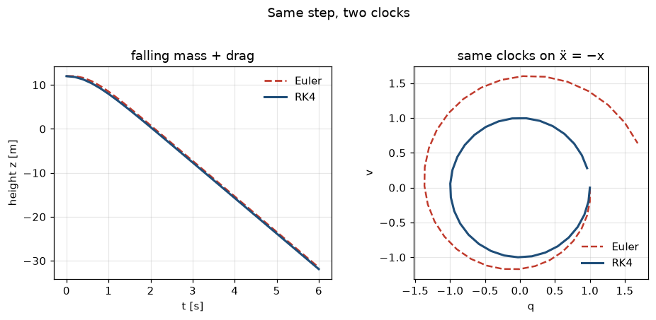 | **01** Six States<br>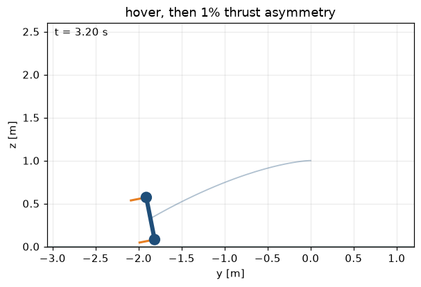 | **02** Into 3D<br> | **03** Cascade PD<br>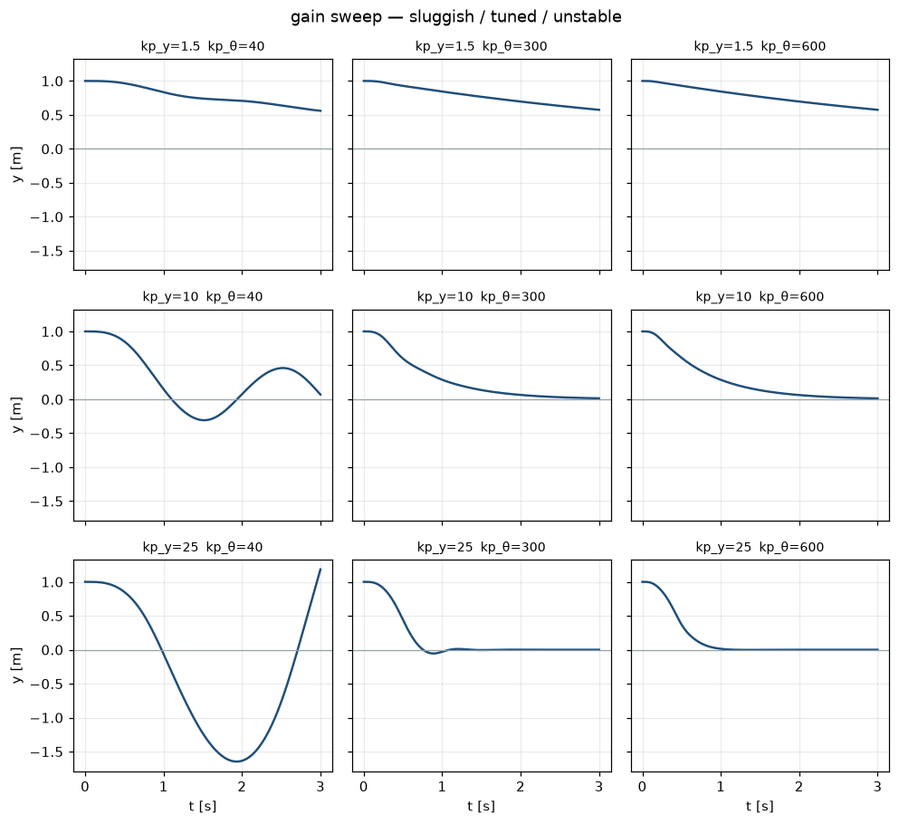 |
| **04** LQR<br> | **05** Search<br> | **06** Heuristics<br> | **07** RRT<br> |
| **08** Flatness<br> | **09** Time scaling<br> | **10** Set belief<br>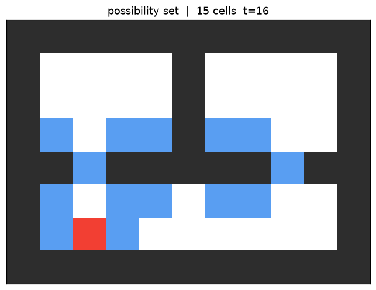 | **11** Bayes<br>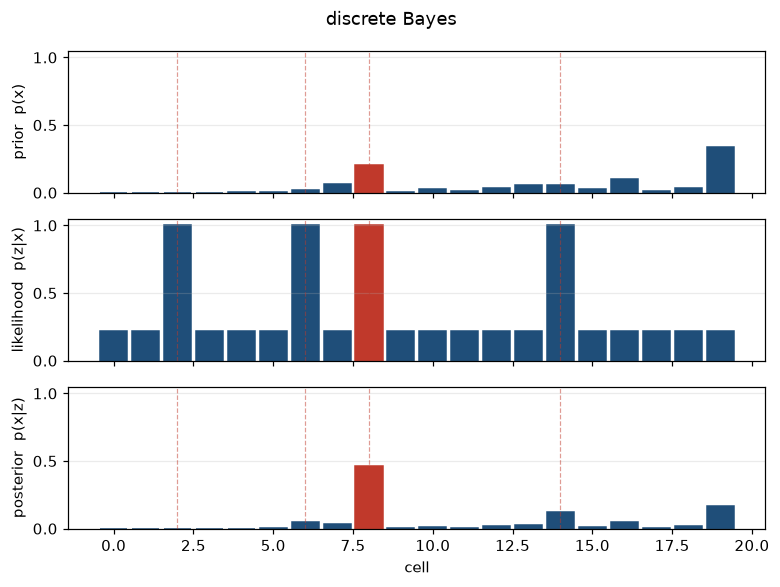 |
| **12** KF / PF<br> | **13** MCL<br> | **14** Mapping<br>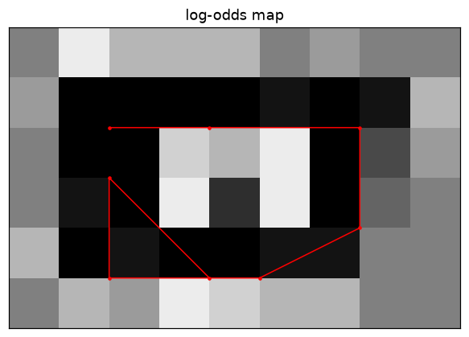 | **15** SLAM<br> |
| **16** Camera<br>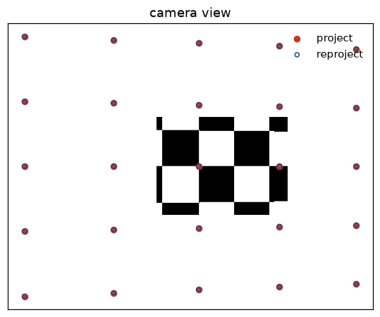 | **17** Optical flow<br>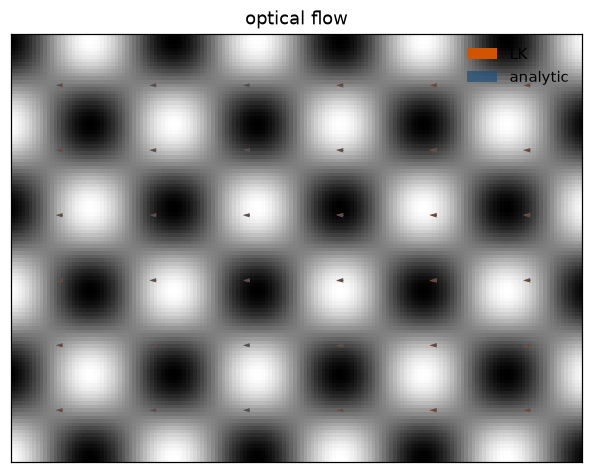 | **18** MLP<br> | **19** SGD<br>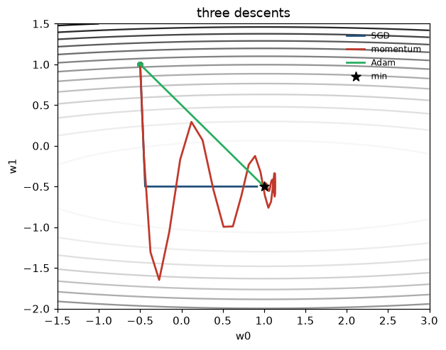 |
| **20** Overfit<br>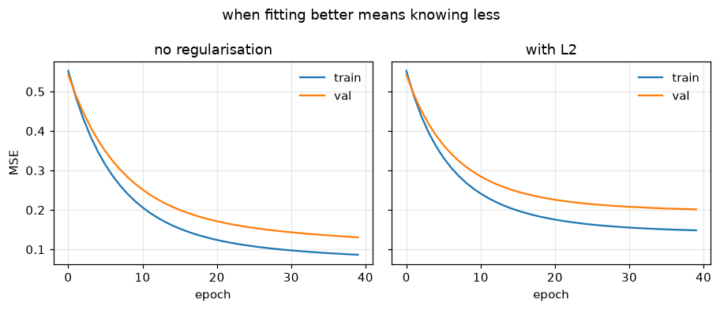 | **21** CNN<br>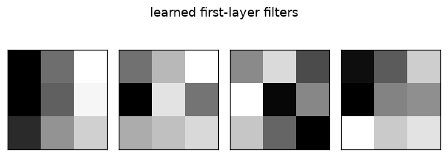 | **22** RL<br>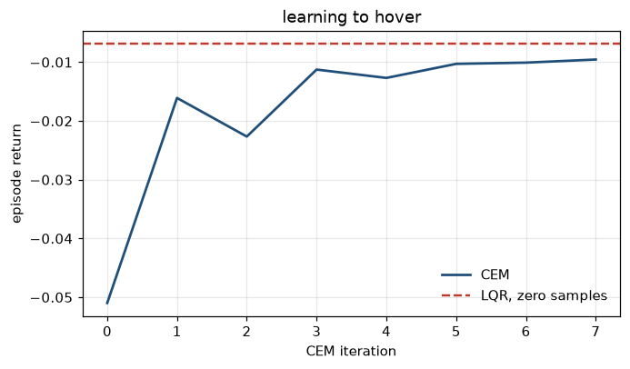 | **23** Red team<br>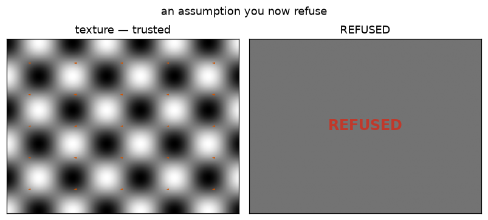 |

The lecture → lab map (L01–L24) is [`docs/LECTURE_LAB_MAP.md`](docs/LECTURE_LAB_MAP.md).

## How a lab works

**Explain** (`README.md`, ≤1 page) → **Tinker** (`lab.py`, the only file you
edit) → **Check** (`check.py`, a table not a stack trace) → **See it**
(`demo.py` → gif) → tick `PROGRESS.md`.

Downstream labs import through `flightlab.resolve.get`. If your earlier lab
isn't passing, you get a warning banner and the `reference/` implementation —
never a blocked week.

## Stack

NumPy + Matplotlib, 2D-first. SciPy for the CARE and a handful of solvers.
That is a decision, not a default (ARCHITECTURE ADR-001):

- You write $\dot{x}=f(x,u)$ yourself. An engine would hide it.
- Install is `pip install -e .`. No GL drivers, no radio dongle.
- Seeds are fixed. Re-running a demo is a visual *diff*, not a new flight.
- Vision labs use synthetic renders — projected geometry, procedural texture,
  analytic optical-flow ground truth.

No Drake, no ROS, no Crazyflie, no hardware. The 3D quadrotor and a unicycle
are secondary plants. PyBullet is an optional Phase-5 parity layer, not a
dependency. Lab 21 accepts `make lab21 BACKEND=torch` if you have it; the
NumPy path is the check.

## Repo map

```
flightlab/     shared core (integrators, plants, viz, checks, resolver)
labs/          one folder per lab; edit lab.py only
reference/     fallback implementations (spoilers; accepted)
content/       lecture notes L01–L24 (NotebookLM source)
tests/         core + every reference check + Lab 23's assumption test
tools/         new_lab, studypack, screencast, random_lab
docs/          ARCHITECTURE, LECTURE_LAB_MAP, PLAN, BACKLOG
```

Built labs: **00–23**. Tick `PROGRESS.md` when *your* `lab.py` is green.
