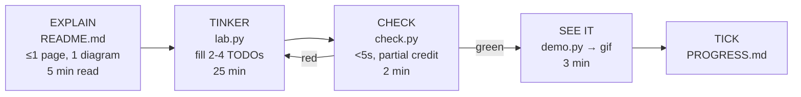
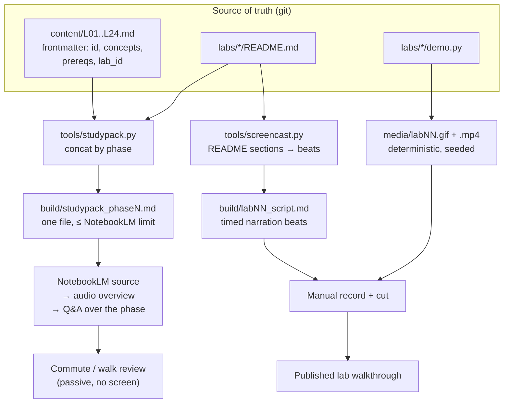

# ARCHITECTURE — `flight-school`

> A hands-on simulation lab for every concept in Princeton's Intro to Robotics (IRoM / Majumdar).
> Pure NumPy first. No hardware required. Ever, optionally.

**Scope note:** This repo is course-only. It has no dependency on, and no awareness of, any other
project. Notes live *inside* this repo as plain markdown — no external vault is ever git-tracked here.

---

## 1. The one decision everything else follows from

**Every lab targets the same plant: the planar quadrotor.**

Control, planning, estimation, vision, and RL all point at one 6-state system you built yourself in
Lab 01. This is not a simplification — it is the load-bearing pedagogical choice:

- **Cognitive load stays flat.** You never re-learn a robot. You learn a *new question about a robot
  you already know.*
- **Labs compose.** The A* path from Lab 06 becomes the min-snap trajectory in Lab 08, tracked by the
  LQR from Lab 04, estimated by the particle filter in Lab 12.
- **The "aha" is transfer, not novelty.** Seeing your Lab 04 controller fly a Lab 08 trajectory
  through a Lab 07 map is the actual learning event.

The 3D quadrotor (L03) and the unicycle (used for grid/SLAM labs) exist as secondary plants, but the
planar quadrotor is the spine.

---

## 2. Simulation stack decision

### Recommendation: NumPy + Matplotlib, 2D-first. PyBullet/MuJoCo deferred to Phase 5 as *optional*. Crazyflie deferred indefinitely.

**Context.** The temptation is to start on a physics engine so the sim "looks real." For a course
whose entire point is that you can write $\dot{x} = f(x,u)$ yourself, that is exactly backwards.

**Rationale:**

| Criterion | NumPy 2D | PyBullet/MuJoCo | Crazyflie |
|---|---|---|---|
| Do you write the dynamics? | Yes — the whole point | No, hidden | No |
| Install friction | `pip install numpy matplotlib` | GL drivers, version pins, headless quirks | radio dongle, firmware, batteries, calibration |
| Time from idea → plot | seconds | tens of seconds | tens of minutes |
| Determinism / reproducibility | total | good | none |
| Debuggability | it's your code | engine internals | physics *and* your code lie to you |
| Failure modes teach you | dynamics | the engine's API | soldering |

For ADHD-friendly work, install friction is not a minor cost — **it is the primary failure mode.** A
lab you can't start in 30 seconds is a lab you don't start.

**Where the engine earns its place (Phase 5, optional):** a *parity layer*. Same controller, harder
plant. You keep your Lab 04 LQR and your Lab 08 trajectory generator, swap `flightlab.dynamics` for a
PyBullet-backed plant with contact, drag, and motor lag, and observe what breaks. That is a genuine
lesson — model mismatch — and it only lands *after* you've built the idealized version.

**Crazyflie:** a stretch goal in the backlog, not in the plan. Hardware is a reward, not a
prerequisite.

**Consequence to accept:** no contact dynamics, no rendering realism. Vision labs (L17–L18, L22) use
*synthetic* renders — projected geometry, procedural textures, analytic optical flow ground truth.
This is a feature: you get exact ground truth for every quantity you're trying to estimate.

---

## 3. Repo layout

```
flight-school/
├── README.md                 # what this is, install, "start here"
├── PROGRESS.md               # checkbox ledger, one line per lab
├── Makefile                  # the ONLY entry point you need to remember
├── pyproject.toml            # editable install, pinned minimal deps
│
├── flightlab/                # shared core — stable, boring, well-tested
│   ├── integrate.py          # euler, rk4, fixed-step loop
│   ├── dynamics/             # planar_quad, quad3d, unicycle, point_mass
│   ├── control/              # base classes + gain containers (NOT solutions)
│   ├── worlds/               # occupancy grids, obstacle sets, corridors
│   ├── sensors/              # range, IMU, camera projection, noise models
│   ├── viz/                  # animate(), scope(), grid_show(), gif export
│   └── checks/               # assertion helpers + the green/red result table
│
├── reference/                # stable fallback implementations (see §5)
│
├── labs/
│   ├── lab00_hello_state/
│   │   ├── README.md         # EXPLAIN  — ≤1 page, exactly one diagram
│   │   ├── lab.py            # TINKER   — the only file you edit
│   │   ├── check.py          # CHECK    — runs in <5s, partial credit
│   │   └── demo.py           # runs in <10s, emits a gif
│   └── ... lab01 … lab23
│
├── content/                  # lecture notes, one file per lecture, fixed schema
├── media/                    # generated gifs/mp4 (gitignored, thumbnails kept)
├── tools/                    # studypack.py, screencast.py, new_lab.py
└── tests/                    # CI: core package + all reference impls
```

**Invariant: one editable file per lab.** `lab.py`. If a lab needs you to touch two files, the lab is
wrong and gets split. Everything else is import-and-use.

---

## 4. The Explain → Tinker → Check loop



**Explain** — a README that answers three questions and nothing else:
1. *Why now?* One sentence connecting to the previous lab.
2. *What's the idea?* One diagram + ≤200 words. No derivations in the README; derivations go in
   `content/L##.md` for when you actually want them.
3. *What will you see?* A thumbnail of the gif you're about to produce. This is the hook.

**Tinker** — `lab.py` is a runnable file with 2–4 `# TODO` blocks, each ≤15 lines of expected code.
Everything around them already works. You never stare at a blank file.

**Check** — `check.py` prints a table, not a stack trace:

```
LAB 04 — LQR at hover
  [PASS] gain matrix shape
  [PASS] closed-loop eigenvalues in LHP
  [FAIL] settling time 4.2s (need <2.0s)   → hint: check your R weighting
  [PASS] cost lower than Lab 03 PD baseline
  3/4 — you're close. Run `make hint04` for a nudge.
```

Partial credit is deliberate. Binary pass/fail on a 4-part lab is an ADHD trap: one red light and the
whole session reads as failure.

---

## 5. The most important architectural decision: labs depend on *interfaces*, not on your past self

**Problem.** Sequential lab courses have a brittle dependency chain. Miss Lab 4, and Labs 5–23 are
locked. For anyone whose attention comes in bursts weeks apart, this guarantees abandonment.

**Solution.** Every lab's solution also exists in `reference/`, behind the identical API. Downstream
labs import from a resolver:

```
# conceptually, in flightlab/resolve.py

def get(name):
    impl = try_import_student(name)      # labs/labNN/lab.py
    if impl is not None and passes_smoke_test(impl):
        return impl
    warn(f"using reference {name} — your Lab {n} isn't done or isn't passing")
    return import_reference(name)
```

**Consequences:**
- ✅ Any lab can be started cold, on any day, in any order that respects declared prereqs.
- ✅ A broken Lab 04 produces a *warning banner*, not a blocked Lab 08.
- ✅ You can deliberately A/B your controller against the reference.
- ⚠️ Spoilers are one `open` away. **Accepted deliberately.** Gating solutions behind a branch or an
  env var adds friction to the exact moment you're already frustrated. Self-discipline is cheaper
  than a locked door you'll break anyway.

Every lab README carries a **Cold Start** block — three bullets of exactly what you need to remember
from prior labs. Returning after three weeks should cost 60 seconds, not 60 minutes.

---

## 6. ADHD-friendly design constraints (treat these as hard requirements)

| Constraint | Why |
|---|---|
| **Every lab ≤ 45 min.** If it doesn't fit, split it. | Session length must match attention length, not topic size. |
| **One command per lab: `make lab07`.** | Zero setup decisions. Decisions are where sessions die. |
| **Every lab ends in a picture, not a number.** | Visual payoff is the reward loop. A printed RMSE is not a reward. |
| **Checks run in <5s, seeds fixed.** | Flaky checks destroy trust; slow checks destroy flow. |
| **`PROGRESS.md` with checkboxes.** | Visible accumulated progress. Cheap dopamine, honestly earned. |
| **Explicit `STOP HERE — good stopping point` markers mid-lab.** | Permission to stop is what makes it possible to restart. |
| **No lab requires reading more than one page before writing code.** | Reading is the highest-abandonment activity in the loop. |
| **`make random`** picks an unlocked, unfinished lab. | Removes "which one should I do?" on low-executive-function days. |
| **A `notes.md` per lab, freeform, never graded.** | Capture without obligation. |

---

## 7. NotebookLM + video pipeline (design only, build in Phase 5)

**Direction is strictly one-way: repo → artifacts.** Nothing generated ever writes back into the
repo's source of truth. This keeps `content/` a clean, diffable, git-native corpus.



**Design constraints:**
- `content/L##.md` uses a fixed frontmatter schema so `studypack.py` is a dumb concatenator, not a
  parser with opinions. Fragile parsing is a maintenance sink.
- **One study pack per phase**, not per lecture. NotebookLM is most useful when it can cross-reference
  four related lectures.
- `demo.py` must be deterministic (fixed seed, fixed duration) so re-recording a video after a code
  change produces a *diffable* visual, not a new random flight.
- The screencast script is generated as **beats, not prose.** You narrate; the tool only sequences.
  Generated narration prose is uncanny and you'll rewrite it anyway.
- **Build outputs go to `build/` and `media/`, both gitignored.** The repo stays small and clonable.

---

## 8. Architecture decisions, stated as ADRs

**ADR-001 — Pure NumPy simulation core.**
*Context:* the course teaches dynamics; engines hide dynamics. *Decision:* hand-written RK4 over a
hand-written `f(x,u)`. *Consequence:* no contact physics; vision must be synthetic; total determinism
and near-zero install friction gained.

**ADR-002 — One plant across all 24 labs.**
*Context:* per-topic toy problems fragment understanding. *Decision:* planar quadrotor as spine.
*Consequence:* some labs need slight contortion to fit the quadrotor; transfer and composition gained.

**ADR-003 — Reference fallbacks behind a resolver.**
*Context:* sequential dependency chains are the top cause of abandonment. *Decision:* every lab
resolves dependencies to student code or reference code. *Consequence:* spoilers accessible; total
order-independence and cold-start capability gained.

**ADR-004 — Checks are graded tables, not assertions.**
*Context:* binary failure is demotivating and uninformative. *Decision:* partial credit, per-criterion
hints. *Consequence:* more work per lab to author; far higher completion rate.

**ADR-005 — Notes live in-repo as markdown.**
*Context:* external note tools create sync problems and coupling. *Decision:* `content/` and
`labs/*/notes.md` are plain markdown in git. *Consequence:* no rich linking/graph features; full
diffability, portability, and a clean NotebookLM source corpus gained.

**ADR-006 — Physics engine as an optional parity layer, not a foundation.**
*Context:* model mismatch is a real lesson, but only after the idealized model is understood.
*Decision:* PyBullet/MuJoCo enters in Phase 5, swappable behind the same `Plant` interface.
*Consequence:* Phase 5 requires the `Plant` interface to have been designed correctly in Phase 0.

> **Note the coupling in ADR-006.** The Phase-5 option only stays cheap if `flightlab.dynamics`
> exposes a narrow, engine-agnostic `Plant` protocol (`state_dim`, `input_dim`, `f(x,u)`, `reset`,
> `bounds`) from day one. This is the single place where a Phase-0 mistake costs you real money later.
> Design that protocol before writing Lab 00.

---

## 9. Calibration note

Given a controls + embedded background, **Phase 1 (L02–L05) and much of Phase 4's RL lab will feel
like review.** Resist the urge to skip them — they build the `Plant` and `Controller` interfaces every
later lab depends on, and the LQR-vs-PD comparison in Lab 04 is what makes Lab 22's RL baseline
meaningful.

The genuine new territory is **Phase 3 (estimation → SLAM)** and **Phase 4's vision labs**. Budget
accordingly: Phase 1 fast, Phase 3 slow.


# LECTURE→LAB MAP
