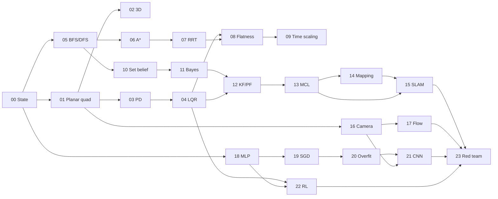

# LECTURE → LAB MAP (L01–L24)

24 lectures → 24 labs. Each lab is one 45-minute session, one editable file, one visual payoff.

**Legend** — `⏱` target minutes · `⇐` prereq labs (resolved to `reference/` if unfinished) · **Payoff**
is the thing you *see*.

---

## Phase 1 — Control

### L01 · Intro → **Lab 00 — Hello, State** ⏱30 ⇐ none
- **Idea:** a robot is a state, a vector field, and a clock.
- **Tinker:** implement Euler and RK4; simulate a falling point mass with drag.
- **Check:** RK4 energy drift < 1e-4 over 10 s; Euler visibly worse at the same step size.
- **Payoff:** two trajectories diverging on one plot. The whole course in one picture.

### L02 · Planar quadrotor → **Lab 01 — Six States and Two Thrusts** ⏱45 ⇐ Lab 00
- **Idea:** derive $\dot{x}=f(x,u)$ for the planar quadrotor; $x=[p_y,p_z,\theta,v_y,v_z,\omega]$.
- **Tinker:** fill in `PlanarQuadrotor.f`; find the hover input analytically; run open loop.
- **Check:** hover equilibrium $u_1=u_2=mg/2$; drift < 1 cm over 5 s; a 1% thrust asymmetry tumbles.
- **Payoff:** animated quadrotor that hovers, then tumbles when you nudge one rotor. **This is the
  plant for the next 22 labs.**

### L03 · 3D + feedback → **Lab 02 — Into 3D, and the First Loop** ⏱45 ⇐ Lab 01
- **Idea:** 12-state 3D quadrotor; why attitude representation matters; the first closed loop.
- **Tinker:** extend to 3D (ZYX Euler is fine here, note the singularity); add a proportional
  altitude loop.
- **Check:** altitude setpoint tracked; deliberately drive it through gimbal lock and observe.
- **Payoff:** 3D animation holding altitude — and a plot of the representation blowing up at 90°.

### L04 · Stability + PD → **Lab 03 — Cascade PD** ⏱45 ⇐ Lab 01
- **Idea:** linearize about hover; eigenvalues as the stability verdict; inner attitude / outer
  position cascade and its timescale separation.
- **Tinker:** compute the linearization numerically; tune the cascade; sweep gains.
- **Check:** all closed-loop eigenvalues in the LHP; settling < 2.5 s; overshoot < 20%; timescale
  ratio ≥ 5.
- **Payoff:** a gain-sweep grid of 9 flights, from sluggish to unstable, side by side.

### L05 · LQR → **Lab 04 — Let the Math Tune It** ⏱45 ⇐ Lab 03
- **Idea:** cost as design language; solve the CARE; optimal ≠ intuitive.
- **Tinker:** build $Q,R$; solve for $K$; race it against your Lab 03 PD on the same disturbance.
- **Check:** stability; integrated cost strictly below the PD baseline; a deliberately bad $R$
  saturates the actuators.
- **Payoff:** overlaid trajectories, LQR vs your hand-tuning. Slightly humbling. That's the lesson.

---

## Phase 2 — Planning

### L06 · BFS/DFS → **Lab 05 — Search, Visualized** ⏱40 ⇐ Lab 00
- **Idea:** graph search as frontier expansion; BFS optimal on unit costs, DFS not.
- **Tinker:** occupancy grid + BFS + DFS with a shared frontier interface.
- **Check:** BFS path length == known optimum; DFS path ≥ BFS; node-expansion counts logged.
- **Payoff:** animated frontier flood-fill. BFS blooms, DFS snakes.

### L07 · Dijkstra/A* → **Lab 06 — Heuristics, Honest and Otherwise** ⏱45 ⇐ Lab 05
- **Idea:** nonuniform costs; admissibility; the expansion/optimality tradeoff.
- **Tinker:** Dijkstra on a terrain costmap; A* with Manhattan/Euclidean; then inflate the heuristic
  by ×2 and watch optimality break.
- **Check:** A* cost == Dijkstra cost with admissible $h$; A* expands ≥30% fewer nodes; inflated $h$
  produces a provably suboptimal path.
- **Payoff:** three expansion heatmaps on one figure.

### L08 · RRT → **Lab 07 — Sampling Your Way Out** ⏱45 ⇐ Lab 06
- **Idea:** why grids fail in high dimensions; RRT, RRT*, and shortcutting.
- **Tinker:** RRT in a 2D obstacle field; add rewiring for RRT*; post-process with shortcutting.
- **Check:** collision-free over 50 seeds; success rate ≥ 90%; RRT* cost < RRT cost.
- **Payoff:** the tree growing. Everyone remembers this animation.

### L09 · Differential flatness → **Lab 08 — Plan in Flat Space, Fly in Real Space** ⏱45 ⇐ Labs 04, 07
- **Idea:** the quadrotor's flat outputs; min-snap polynomials through waypoints; recovering $u$ from
  derivatives; feedforward + feedback.
- **Tinker:** fit a piecewise polynomial through the Lab 07 waypoints; invert to nominal inputs; track
  with your Lab 04 LQR.
- **Check:** tracking RMSE with feedforward ≪ feedback-only (target ≥5× reduction).
- **Payoff:** **the composition lab.** Lab 07's path, Lab 08's trajectory, Lab 04's controller, Lab
  01's plant — all in one gif. This is the emotional high point of Phase 2.

### L10 · Dynamics constraints → **Lab 09 — Time Is the Free Variable** ⏱40 ⇐ Lab 08
- **Idea:** the geometric path is feasible or not depending only on how fast you traverse it;
  time-scaling and thrust saturation.
- **Tinker:** binary-search the time scaling until $u$ hits its bounds; report the minimum feasible
  duration.
- **Check:** $u$ within bounds everywhere; a 5% faster scaling violates them.
- **Payoff:** thrust-vs-time plots for three scalings, with the saturation band shaded.

---

## Phase 3 — Estimation

### L11 · Nondeterminism / set-based → **Lab 10 — Where Could I Possibly Be?** ⏱40 ⇐ Lab 05
- **Idea:** uncertainty before probability; propagating a *set* of possible states under bounded
  disturbance.
- **Tinker:** propagate a belief set over a grid under nondeterministic motion; intersect with sensor
  constraints.
- **Check:** the true state is inside the set at every timestep, 100 seeds; set size grows without
  measurements, shrinks with them.
- **Payoff:** the possibility cloud breathing in and out.

### L12 · Bayes → **Lab 11 — Prior, Likelihood, Posterior** ⏱40 ⇐ Lab 10
- **Idea:** the discrete Bayes filter as the same picture as Lab 10, with weights.
- **Tinker:** 1D corridor, doors as landmarks; implement predict and update separately.
- **Check:** posterior sums to 1; converges to truth within 8 observations; a deliberately wrong
  sensor model produces confident-and-wrong (log it — this matters for L24).
- **Payoff:** the classic three-stacked-histograms animation.

### L13 · KF/PF → **Lab 12 — Two Ways to Carry a Belief** ⏱45 ⇐ Labs 04, 11
- **Idea:** Gaussian closed form vs. sample-based; when each breaks.
- **Tinker:** KF on the hover linearization; particle filter on the full nonlinear plant; same data.
- **Check:** KF NEES within the 95% consistency band; PF RMSE below threshold; break the KF by
  starting far from hover and show the PF surviving.
- **Payoff:** covariance ellipse vs. particle cloud, side by side, on the same flight.

### L14 · Localization → **Lab 13 — Known Map, Unknown Pose** ⏱45 ⇐ Lab 12
- **Idea:** Monte Carlo localization; the kidnapped-robot problem; particle depletion.
- **Tinker:** MCL with a range sensor in a known 2D map; then teleport the robot mid-run.
- **Check:** converges from a uniform prior in <40 steps; recovers from kidnapping when injection is
  on, fails when it's off.
- **Payoff:** particle cloud collapsing onto the true pose. Then scattering. Then re-collapsing.

### L15 · Mapping → **Lab 14 — Known Pose, Unknown Map** ⏱40 ⇐ Lab 13
- **Idea:** the mirror problem; occupancy grids; log-odds because multiplication is a trap.
- **Tinker:** inverse sensor model + log-odds accumulation from a ground-truth trajectory.
- **Check:** map IoU vs. ground truth ≥ 0.85; log-odds version numerically stable where naive
  probability underflows.
- **Payoff:** the map fogging in as the robot drives.

### L16 · SLAM → **Lab 15 — Both at Once** ⏱45 ⇐ Labs 13, 14
- **Idea:** the chicken-and-egg; drift; loop closure as the thing that actually saves you.
- **Tinker:** 2D pose-graph SLAM — odometry edges, a loop-closure edge, one Gauss-Newton solve.
- **Check:** absolute trajectory error drops ≥60% after adding the loop closure; map coherence
  visibly restored.
- **Payoff:** the before/after snap. Best single moment in the course.

---

## Phase 4 — Vision, Learning, RL

### L17 · Vision → **Lab 16 — The Camera Is a Matrix** ⏱45 ⇐ Lab 01
- **Idea:** pinhole model, intrinsics/extrinsics, projection and its inverse ambiguity.
- **Tinker:** render synthetic landmark views from the quadrotor's pose; calibrate $K$ from known
  correspondences; reproject.
- **Check:** reprojection error < 0.5 px; recovered $K$ within 2% of ground truth.
- **Payoff:** synthetic camera view rendered next to the world view, moving together.

### L18 · Optical flow → **Lab 17 — Motion From Brightness** ⏱45 ⇐ Lab 16
- **Idea:** the brightness constancy assumption; Lucas-Kanade; the aperture problem.
- **Tinker:** LK on a synthetic image sequence from Lab 16; convert flow to a velocity estimate; feed
  it into the hover controller as the only velocity source.
- **Check:** flow error vs. analytic ground truth below threshold; hover drift with flow-based
  velocity < 10× the full-state baseline; a textureless region visibly fails.
- **Payoff:** flow-vector quiver overlay, plus a hover that *almost* works. The gap is the lesson.

### L19 · Deep learning → **Lab 18 — An MLP You Can Read** ⏱45 ⇐ Lab 00
- **Idea:** forward pass, loss, backprop as the chain rule and nothing more.
- **Tinker:** NumPy MLP from scratch; learn the Lab 04 LQR policy from state-action pairs.
- **Check:** analytic gradients match finite differences to 1e-6; learned policy stabilizes hover.
- **Payoff:** a neural net flying the quadrotor. Badly at first.

### L20 · SGD → **Lab 19 — The Shape of the Descent** ⏱40 ⇐ Lab 18
- **Idea:** batch vs. stochastic; momentum; adaptive rates; the learning-rate cliff.
- **Tinker:** SGD / momentum / Adam on the same loss surface; sweep learning rates.
- **Check:** all three reach the loss threshold; the sweep locates the divergence boundary.
- **Payoff:** three optimizer paths traced over a 2D loss contour.

### L21 · Overfitting → **Lab 20 — When Fitting Better Means Knowing Less** ⏱40 ⇐ Lab 19
- **Idea:** train/val split, capacity, regularization, early stopping, learning curves.
- **Tinker:** shrink the dataset until the model memorizes; add L2 and early stopping; read the curves.
- **Check:** a train/val gap is induced deliberately, then closed to <15% by regularization.
- **Payoff:** the textbook diverging-curves plot — but from your own broken model.

### L22 · CNN → **Lab 21 — Weight Sharing Earns Its Keep** ⏱45 ⇐ Lab 20
- **Idea:** convolution as a structural prior; translation equivariance; why an MLP wastes parameters
  on images.
- **Tinker:** small conv net (NumPy conv, or PyTorch behind a flag) detecting gate position in Lab 16
  renders; compare against a parameter-matched MLP.
- **Check:** CNN accuracy > MLP accuracy at equal parameter count; learned first-layer filters look
  like edge detectors.
- **Payoff:** the filter grid. It always looks like edges, and it's always satisfying.

### L23 · RL → **Lab 22 — Learning to Hover Without Being Told How** ⏱45 ⇐ Labs 04, 19
- **Idea:** reward vs. cost; policy gradient / CEM; sample inefficiency measured honestly against a
  controller you already have.
- **Tinker:** CEM or REINFORCE on the planar quadrotor hover; reward shaping ablation.
- **Check:** episode return ≥ threshold; report the LQR gap and the sample count it took to *not*
  beat it.
- **Payoff:** the learning curve, next to a flat dashed line labelled "LQR, zero samples."

---

## Phase 5 — Reflection

### L24 · Ethics → **Lab 23 — Red-Team Your Own Stack** ⏱45 ⇐ everything
- **Idea:** the failure modes you've already produced, taken seriously. Not a bolt-on lecture.
- **Tinker:** two parts. (a) Written: a one-page failure analysis of *your* repo — the confidently
  wrong Bayes filter from Lab 11, the textureless-region flow failure from Lab 17, the CNN's
  distribution shift, the RL reward hack you may have found. (b) Code: add one adversarial test to
  `tests/` that makes a previously-passing lab fail under a realistic assumption violation.
- **Check:** the adversarial test exists, is red against the old assumption and green against a
  documented mitigation; the written analysis references specific lab artifacts by filename.
- **Payoff:** a test in your own repo that encodes something you now refuse to assume. That's the
  most durable form the lesson can take.

---

## Dependency graph

Every edge is soft — an unfinished prereq resolves to `reference/` with a warning banner.

# PLAN
