# PLAN — phased build

Six phases. Each has a **single exit criterion** you can test, not a feeling of doneness.

Effort is quoted in **sessions** (≈90 min of building, distinct from the 45-min lab-*doing* budget).
Building a lab costs roughly 2–3× doing it.

```mermaid
gantt
    dateFormat X
    axisFormat %s
    title Build order (unit = sessions)
    section P0
    Scaffold + Lab 00 exemplar   :p0, 0, 6
    section P1
    Control  L02-L05             :p1, after p0, 8
    section P2
    Planning L06-L10             :p2, after p1, 10
    section P3
    Estimation L11-L16           :p3, after p2, 14
    section P4
    Vision/ML/RL L17-L23         :p4, after p3, 16
    section P5
    Polish + pipeline + L24      :p5, after p4, 10
```

---

## Phase 0 — Scaffold ▸ ~6 sessions

**Goal:** make lab *authoring* a solved problem, so Phases 1–4 are content, not architecture.

**Build:**
1. `pyproject.toml`, editable install, minimal pinned deps (numpy, matplotlib, pytest, imageio).
2. **The `Plant` protocol** — `state_dim`, `input_dim`, `f(x,u)`, `bounds`, `reset`. Get this right;
   ADR-006 (the optional PyBullet parity layer) depends entirely on it.
3. `flightlab/integrate.py` — Euler + RK4 + a fixed-step rollout loop.
4. `flightlab/viz/` — `animate()`, `scope()`, `save_gif()`. Deterministic output, fixed seeds.
5. `flightlab/checks/` — the graded-table runner with partial credit and per-criterion hints.
6. `flightlab/resolve.py` — the student-impl → reference resolver (ARCHITECTURE §5).
7. `Makefile` — `make labNN`, `make checkNN`, `make demoNN`, `make hintNN`, `make random`,
   `make progress`.
8. `tools/new_lab.py` — scaffolds a lab directory from template. **Do not skip this.** It's the
   difference between 23 labs and 6.
9. `PROGRESS.md` + `README.md` with a "Start here → `make lab00`" as the first line.
10. CI: run core tests + every reference implementation on push.
11. **Lab 00 built end to end** as the exemplar all others are cloned from.

**Exit criterion:**
> On a clean clone, on a machine with only Python installed:
> `pip install -e . && make lab00` gets a first-time user to a rendered gif in **under 2 minutes**,
> with zero decisions to make.

Time this with a stopwatch. If it fails, Phase 0 isn't done — and every later phase inherits the cost.

---

## Phase 1 — Control ▸ ~8 sessions · Labs 01–04 (L02–L05)

**Goal:** the plant and the controller interfaces, plus the four labs that exercise them.

**Build order:** Lab 01 (plant) → Lab 03 (PD) → Lab 04 (LQR) → Lab 02 (3D). *Deliberately out of
lecture order* — 3D is a side quest, and building it third would stall the more valuable
PD → LQR arc.

**Watch for:** this is the phase where a controls background will tempt you to over-build — a full
attitude-representation library, an ILQR detour. Don't. The deliverable is four 45-minute labs.

**Exit criterion:**
> `make check01 check02 check03 check04` all green, and the Lab 04 demo produces a side-by-side
> LQR-vs-PD gif from a single command.

---

## Phase 2 — Planning ▸ ~10 sessions · Labs 05–09 (L06–L10)

**Goal:** search, sampling, and the first real composition across phases.

**Build:** `flightlab/worlds/` (grids, obstacle sets, terrain costmaps) → Labs 05, 06, 07 → then Lab
08, which is the integration test for the entire architecture. Lab 09 is small and closes the phase.

**Risk:** Lab 08 (flatness) is where the resolver gets its first hard test — it imports a controller
from Phase 1 and a path from earlier in Phase 2. If the fallback mechanism is going to be wrong, it
will be wrong here. Budget an extra session.

**Exit criterion:**
> Lab 08's demo runs with `labs/lab04/lab.py` deleted, prints the reference-fallback warning, and
> still produces a correct flight.

That is the real test of ADR-003, and it's worth constructing deliberately.

---

## Phase 3 — Estimation ▸ ~14 sessions · Labs 10–15 (L11–L16)

**Goal:** the longest and most valuable phase. Six labs, plus a sensor-model layer.

**Build:** `flightlab/sensors/` (range sensor with beam model, IMU with bias, noise generators) →
Labs 10 → 11 → 12 → 13 → 14 → 15, strictly in order. Each genuinely builds on the last.

**Risk:** Lab 15 (SLAM) is the single largest lab in the repo and will want to become three sessions
and 300 lines. **Constrain it hard:** 2D pose-graph, one loop closure, one Gauss-Newton iteration
loop, sparse solver from scipy. Landmark-based FastSLAM and full bundle adjustment are backlog items,
not Lab 15.

**Slow down here.** Given a controls-heavy background, this is the phase with the most new material
per hour. The temptation is to speed up because Phases 1–2 went fast. Resist it.

**Exit criterion:**
> Lab 15 produces the before/after loop-closure figure, with a measured ATE reduction ≥60%, from
> `make demo15`, in under 30 seconds.

---

## Phase 4 — Vision, Learning, RL ▸ ~16 sessions · Labs 16–22 (L17–L23)

**Goal:** seven labs, plus the synthetic renderer — the biggest new subsystem since Phase 0.

**Build:** `flightlab/render/` first (pinhole projection, procedural texture, analytic flow ground
truth) — Labs 16, 17, and 21 all depend on it. Then Labs 16 → 17. Then the ML arc 18 → 19 → 20 → 21,
which is largely independent. Lab 22 (RL) last.

**Decision point:** NumPy-only for Labs 18–21, or PyTorch behind a flag?
- **Recommendation:** NumPy for Labs 18–20 (the point is that backprop is the chain rule), PyTorch
  *optional* for Lab 21 (a NumPy conv is educational once and painfully slow thereafter). Gate it:
  `make lab21 BACKEND=torch`. The check must pass under both.

**Watch for:** an RL thesis makes Lab 22 the easiest lab in this phase to over-engineer. Its job is
one honest comparison — sample count vs. LQR — not a PPO implementation.

**Exit criterion:**
> `make check16 … check22` all green, and Lab 22's learning-curve plot includes the LQR reference
> line with its zero-sample annotation.

---

## Phase 5 — Polish ▸ ~10 sessions

**Goal:** make it public, make it revisitable, make it honest.

**Build, in priority order:**
1. **Lab 23 (L24, ethics/red-team)** — needs all prior labs to exist, which is why it lands here.
2. **`README.md` for the public** — the gif grid. 24 thumbnails in a table is the entire pitch.
3. **`tools/studypack.py`** — phase-level markdown concatenation for NotebookLM (ARCHITECTURE §7).
4. **`content/L01–L24.md`** backfilled — the derivations you deliberately kept out of lab READMEs.
5. **`tools/screencast.py`** — README → narration beats; deterministic media regeneration.
6. **PyBullet parity layer** (optional) — one alternative `Plant` implementation, one comparison lab
   showing your Lab 04 LQR degrading under motor lag and drag. *Only if the `Plant` protocol held up.*
7. **Cold-start audit** — re-read every lab README as if three weeks have passed. Fix every one that
   costs more than 60 seconds to re-enter.

**Exit criterion:**
> A stranger clones the repo, reads the README, and completes Lab 00 through Lab 04 without asking
> you a question. Test this with an actual person.

---

## Cross-cutting rules

- **Never build two labs in one session.** Half-built labs are the worst state for this repo.
- **A lab isn't done until its check gives partial credit and at least one useful hint.** Green
  assertions are not the deliverable.
- **Regenerate media only at phase boundaries.** Deterministic demos make this a diff, not a redo.
- **`PROGRESS.md` gets updated in the same commit as the lab.** Otherwise it drifts and stops being
  trustworthy, and an untrustworthy ledger is worse than none.
