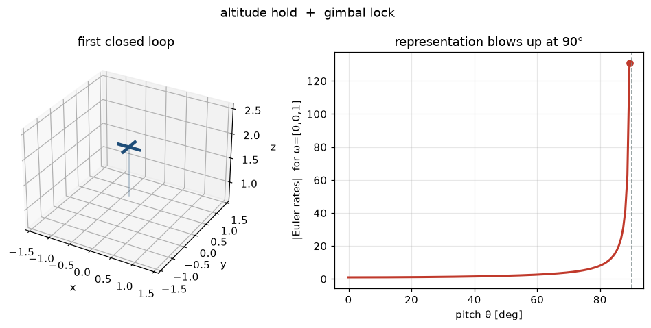

# Lab 02 — Into 3D, and the First Loop

⏱ 45 min · ⇐ Lab 01 · Phase 1

## Why now?

Lab 01 was a slice. The same Newton–Euler story in 3D is twelve numbers — and
the attitude representation you pick can lie to you.

## What's the idea?

ZYX Euler angles ``(φ, θ, ψ)``. Body rates ``ω`` do **not** equal ``[φ̇, θ̇, ψ̇]``:

```
φ̇ = p + q sinφ tanθ + r cosφ tanθ
θ̇ = q cosφ − r sinφ
ψ̇ = (q sinφ + r cosφ) / cosθ
```

At ``θ = ±90°`` the map divides by zero. That is gimbal lock — a chart
failure, not a physics failure.

The first closed loop is humble: hold altitude with

``T = mg + k_p (z_des − z) − k_d v_z``, torques zero.

## What will you see?

A 3D vehicle climbing to a setpoint, next to Euler-rate magnitude exploding
as pitch approaches 90°. `media/lab02.gif`.



## Cold Start

- Planar Lab 01: ``T`` along body +z, gravity ``−g ẑ``. Same here, plus two more axes.
- ``rotation_zyx(φ,θ,ψ)`` is provided — body→world.
- Hover: ``T = mg``, ``τ = 0``.

## Run

```bash
python labs/lab02_into_3d/check.py
python labs/lab02_into_3d/demo.py
```
