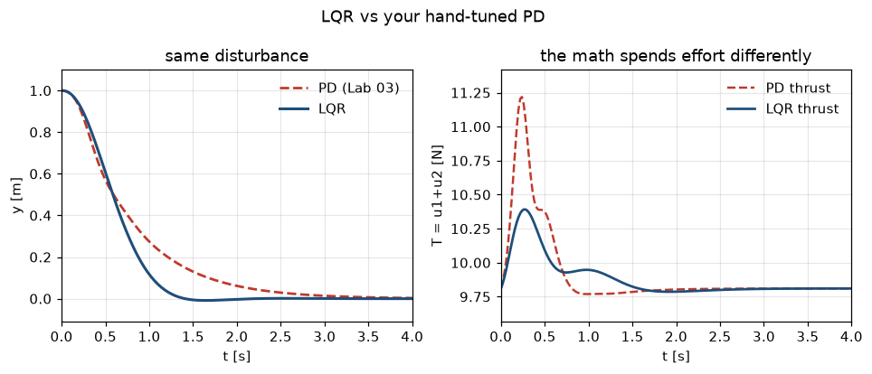

# Lab 04 — Let the Math Tune It

⏱ 45 min · ⇐ Lab 03 · Phase 1

## Why now?

You hand-tuned a cascade. LQR asks a different question: *what do you want
to pay for?* The answer is two matrices, not six gains.

## What's the idea?

Infinite-horizon LQR: pick ``Q ⪰ 0``, ``R ≻ 0``, solve the CARE for ``P``,
then ``K = R⁻¹ Bᵀ P``. The policy is

```
u = u_hover − K (x − x_hover)
```

Optimal for *that* cost, on the *linearization*. Your Lab 03 PD is the
baseline — same disturbance, same plant. Optimal ≠ pretty.

A deliberately tiny ``R`` makes ``K`` huge. The rotors saturate. That's a
feature of the cost, not a bug in the solver.

**STOP HERE — good stopping point** after TODO 2 once ``A−BK`` is Hurwitz.

## What will you see?

Overlaid y(t) and thrust: LQR vs your PD. Slightly humbling. `media/lab04.gif`.



## Cold Start

- Lab 03: ``linearize``, cascade PD, hover ``x_eq = [0,1,0,0,0,0]``.
- ``resolve.get("lab03")`` falls back to ``reference/`` if your PD isn't done.
- CARE = ``scipy.linalg.solve_continuous_are``.

## Run

```bash
python labs/lab04_lqr/check.py
python labs/lab04_lqr/demo.py
```
