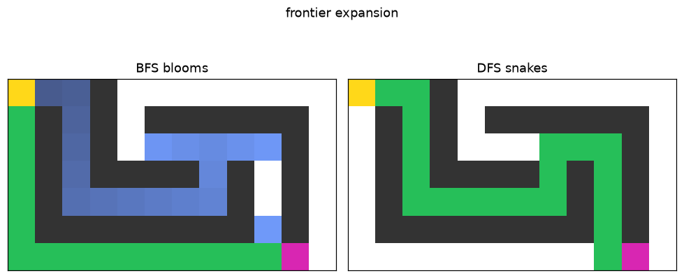

# Lab 05 — Search, Visualized

⏱ 40 min · ⇐ Lab 00 · Phase 2

## Why now?

Control held hover. Planning asks a new question about the same world: *which
cells do I visit, and in what order?*

## What's the idea?

One loop. The only difference is the frontier:

```
queue  → BFS  → shortest on unit costs     (blooms)
stack  → DFS  → no length promise          (snakes)
```

Mark a cell when you **push** it. `grid.neighbors` is 4-connected. `reconstruct`
is provided.

## What will you see?

Two floods on the same maze. BFS is a diamond; DFS is a thread. `media/lab05.gif`.



## Cold Start

- A path is a list of ``(row, col)``. Length in *edges* is ``len(path) - 1``.
- ``#`` is a wall. ``S`` / ``G`` are given by ``maze_lab05()``.
- You do not need Lab 01's quadrotor here.

## Run

```bash
python labs/lab05_search_visualized/check.py
python labs/lab05_search_visualized/demo.py
```
