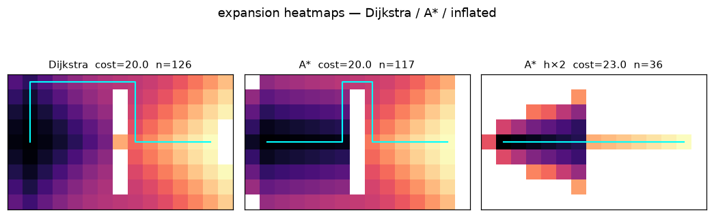

# Lab 06 — Heuristics, Honest and Otherwise

⏱ 45 min · ⇐ Lab 05 · Phase 2

## Why now?

BFS treated every step as 1. Terrain doesn't. A heuristic is a promise
about the leftover cost — keep it honest, or lose optimality.

## What's the idea?

```
Dijkstra   priority = g
A*         priority = g + h      (optimal if h is admissible)
inflated   h ← 2h                (faster, lying, often shorter-looking)
```

Edge cost ``u → v`` is the cost to *enter* ``v``. Manhattan is admissible
on a 4-connected grid whose cheapest cell costs 1.

**STOP HERE — good stopping point** after Dijkstra matches a hand-traced
path. A* is the same loop with one extra term.

## What will you see?

Three expansion heatmaps. Dijkstra floods, A* aims, inflated A* cheats.
`media/lab06.gif`.



## Cold Start

- Lab 05: frontier + ``came_from`` + ``reconstruct``.
- ``terrain_lab06()`` is a cheap detour vs an expensive door.
- ``import heapq``.

## Run

```bash
python labs/lab06_heuristics/check.py
python labs/lab06_heuristics/demo.py
```
