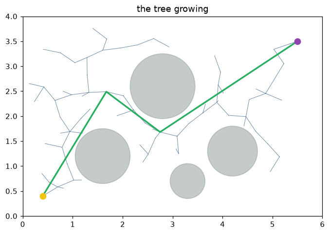

# Lab 07 — Sampling Your Way Out

⏱ 45 min · ⇐ Lab 06 · Phase 2

## Why now?

Grids were honest in 2-D. They explode in dimension. Sampling grows a tree
only where you need it.

## What's the idea?

```
sample a point  →  steer a step from the nearest node
                 →  keep it if the segment is free
```

RRT* also *rewires*: in a ball, pick the cheapest parent, then see if the
new node makes a neighbor cheaper. Shortcut afterwards — skip vertices
when the straight line is clear.

## What will you see?

A tree filling the forest, then a green path snapping tight. `media/lab07.gif`.



## Cold Start

- ``ObstacleField.collide_segment(a, b)`` and ``sample_free(rng)``.
- ``parents[i]`` is an index; root is ``-1``.
- Fix the seed. Random planning that isn't seeded is a flake, not a lab.

## Run

```bash
python labs/lab07_rrt/check.py
python labs/lab07_rrt/demo.py
```
