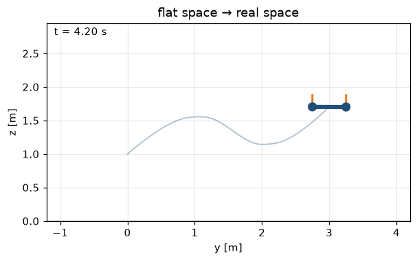

# Lab 08 — Plan in Flat Space, Fly in Real Space

⏱ 45 min · ⇐ Labs 04, 07 · Phase 2

## Why now?

You can grow a path (Lab 07) and you can track hover (Lab 04). Flatness is
the dictionary between them: plan ``(y,z)``, recover ``x`` and ``u``.

## What's the idea?

For the planar quadrotor the flat outputs are position. Then

```
θ = atan2(−ÿ, z̈ + g)
T = m √(ÿ² + (z̈+g)²)
```

A piecewise quintic through waypoints is the 45-minute stand-in for
min-snap. Fly it with **feedforward + LQR**: ``u = u_nom − K(x − x_nom)``.
Feedback-only (hover as the feedforward) is the baseline. You want ≥5×
less RMSE.

**STOP HERE — good stopping point** after hover inversion is exact
(``ÿ=z̈=0 ⇒ T=mg, θ=0``).

## What will you see?

The composition gif: path, trajectory, LQR, plant. `media/lab08.gif`.



## Cold Start

- Lab 04 via ``resolve.get("lab04")`` — unfinished PD/LQR falls back.
- ``piecewise_quintic`` / ``eval_piecewise`` live in ``flightlab.planning``.
- Waypoints are already in ``WAYPOINTS`` (a Lab-07-shaped corridor).

## Run

```bash
python labs/lab08_flatness/check.py
python labs/lab08_flatness/demo.py
```
