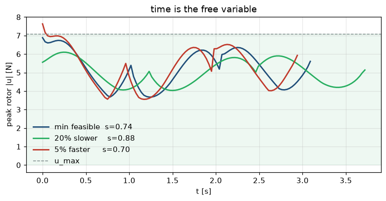

# Lab 09 — Time Is the Free Variable

⏱ 40 min · ⇐ Lab 08 · Phase 2

## Why now?

Lab 08 gave you a geometric path plus a clock. The path is feasible or not
*only* depending on how fast that clock runs. Thrust saturates first.

## What's the idea?

Scale every segment duration by ``s``. ``s < 1`` is faster: accelerations
grow like ``1/s²``, so ``T`` grows, and eventually a rotor hits ``u_max``.

Binary-search the smallest feasible ``s``. A 5% faster clock should break
the bound — that's how you know you found the edge, not a lucky guess.

## What will you see?

Thrust-vs-time for three clocks, saturation band shaded. `media/lab09.gif`.



## Cold Start

- Lab 08: ``sample_flat_traj(..., scale=s)`` via ``resolve.get("lab08")``.
- Hover per rotor is ``mg/2``. ``u_max`` in the check is ``0.72 mg``.
- Return the feasible end of the bracket (the high side).

## Run

```bash
python labs/lab09_time_scaling/check.py
python labs/lab09_time_scaling/demo.py
```
