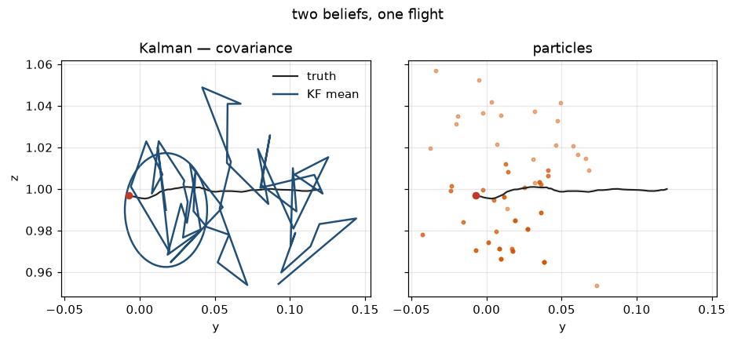

# Lab 12 — Two Ways to Carry a Belief

⏱ 45 min · ⇐ Labs 04, 11 · Phase 3

## Why now?

Lab 11 carried a histogram. Two scalable cousins: a Gaussian (Kalman) and a
bag of samples (particle filter). Same hover flight, two pictures.

## What's the idea?

The hover linearization ``ẋ = Ãx + B̃u`` is a linear Gaussian. The KF is
the closed-form Bayes filter on that model.

The particle filter ignores the linearization: each particle steps
``plant.f`` (the Lab 01 nonlinear plant) and is reweighted by the same
``p(z|x)``.

Start far from hover and the linearization lies. The KF's NEES blows up.
The particles do not care.

## What will you see?

Covariance ellipse next to a particle cloud, same truth in red. `media/lab12.gif`.



## Cold Start

- State ``x = [y, z, θ, vy, vz, ω]``. We observe ``(y, z, θ)``.
- Discrete error-state: ``μ⁺ = x_eq + A(μ−x_eq) + B(u−u_eq)``. ``kf_predict`` is the linear ``A, Q`` part.
- ``pf_weights`` and ``nees`` are provided. You write predict / update / resample.
- Lab 04's ``K`` comes from ``resolve.get("lab04")``.

## STOP HERE — good stopping point

KF green first. Particles are the same Bayes step with a different representation.

## Run

```bash
python labs/lab12_kf_pf/check.py
python labs/lab12_kf_pf/demo.py
```
