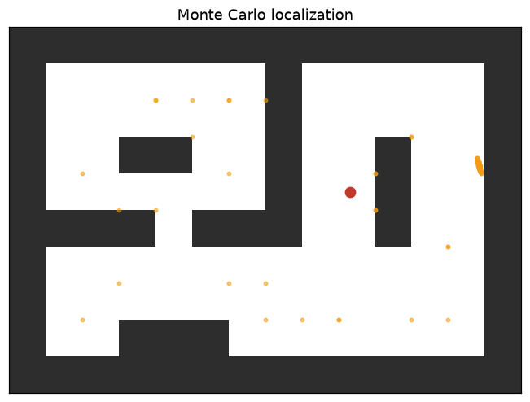

# Lab 13 — Known Map, Unknown Pose

⏱ 45 min · ⇐ Lab 12 · Phase 3

## Why now?

Lab 12's particles lived in the quadrotor's state. Same particles, now the
question is *where on the map?* That's Monte Carlo localization.

## What's the idea?

Known occupancy grid. Unknown pose ``(x, y, θ)``.

```
motion   sample oplus(p, [dx+ν, 0, dθ+ν])
weight   beam model vs. the map
resample systematic, plus optional uniform injection
```

Kidnap the robot mid-run. Without injection the cloud is depleted — every
particle is in the old room. With injection, a few random guesses re-seed
the filter and it finds you again.

## What will you see?

A yellow cloud collapsing onto the red pose, then scattering, then
re-collapsing. `media/lab13.gif`.



## Cold Start

- ``office_lab13()`` is the map. ``sensor.expected(pose, grid)`` is the beam model.
- ``oplus`` / ``uniform_particles`` / ``mean_pose`` are provided.
- ``inject=0.18`` means replace 18% of particles after resample.

## STOP HERE — good stopping point

Green on convergence before you add kidnapping.

## Run

```bash
python labs/lab13_mcl/check.py
python labs/lab13_mcl/demo.py
```
