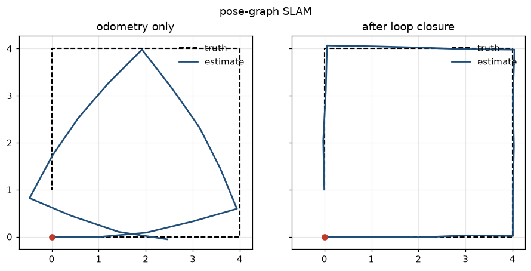

# Lab 15 — Both at Once

⏱ 45 min · ⇐ Labs 13, 14 · Phase 3

## Why now?

Pose unknown, map unknown. That is SLAM. We refuse to build FastSLAM or
bundle adjustment in 45 minutes. One 2-D pose graph, one loop closure,
one Gauss-Newton loop.

## What's the idea?

Poses ``x_i = (x, y, θ)``. Each odometry step is an edge ``z_{i,i+1}``.
They drift. The last pose *should* be the first — that's the loop-closure
edge.

```
error     e = ominus(z, ominus(x_i, x_j))
optimize  hold x_0 fixed; Gauss-Newton on the rest
```

``gauss_newton_step`` is provided. You write the error, the open-loop
compose, and the iteration.

## What will you see?

A square that doesn't close, then snaps shut. `media/lab15.gif`.



## Cold Start

- ``ominus`` / ``oplus`` / ``wrap`` live in ``flightlab.geometry``.
- ``loop_dataset_lab15()`` gives ground truth, drifted odom edges, one loop edge.
- ATE is RMSE of ``(x, y)``. Need ≥60% drop after the loop.

## STOP HERE — good stopping point

If ``edge_error`` is green, the optimizer is just a for-loop.

## Run

```bash
python labs/lab15_slam/check.py
python labs/lab15_slam/demo.py
```
