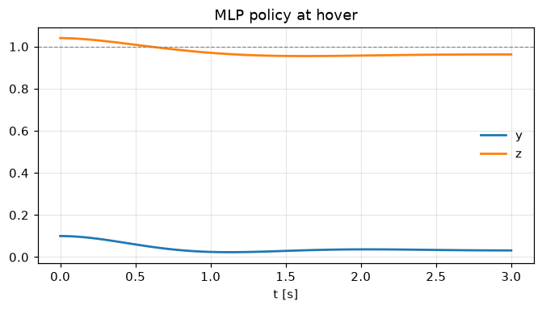

# Lab 18 — An MLP You Can Read

⏱ 45 min · ⇐ Lab 00 · Phase 4

## Why now?

Lab 04's LQR is a matrix. An MLP is a stack of them plus a kink. Write the
forward pass and the chain rule yourself — then steal Lab 04's policy.

## What's the idea?

```
h    = relu(x W1 + b1)
yhat = h W2 + b2
L    = mean (yhat − u_LQR)²
```

Backward is the chain rule, nothing more. Match finite differences to
``1e-6``. Then close the loop on the planar quadrotor.

## What will you see?

A neural net flying — badly at first, then a hover. `media/lab18.gif`.



## Cold Start

- ``lqr_policy_dataset()`` uses ``get("lab04")``. Spoilers are a banner, not a wall.
- Shapes: ``x (N,6)``, ``W1 (6,16)``, ``W2 (16,2)``.
- ReLU gradient is the mask ``z > 0``.

## STOP HERE — good stopping point

Grads matching finite differences is the whole lesson. Flying is dessert.

## Run

```bash
python labs/lab18_mlp/check.py
python labs/lab18_mlp/demo.py
```
